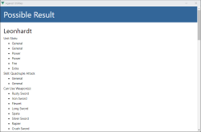
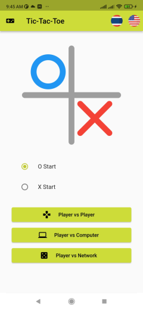
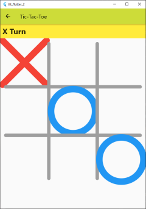

About Oo+
=========

* 👋 Hi, I’m Taworn Ta., nickname Oo+.
* 📫 Reach me in taworn.ta77@gmail.com.

--------------------

# Repositories That You Might Intestest

## Laraland

 | 

 | 

Full-stack sample client/server.

Written by PHP + Laravel + Vue.

Database used MySQL.

https://gitlab.com/taworn.ta7/samples.laraland

--------------------

## Icebomb

 |  | 

 |  | 

Full-stack sample client/server.

Written by Go and Vue.

Database used MySQL.

https://gitlab.com/taworn.ta7/samples.icebomb

--------------------

## Coldfire

 |  | 

 |  | 

Full-stack sample client/server.

Written by:

* Flutter
* Vue
* Nest
* TypeScript.

Database used MySQL, SQLite or MongoDB.

https://gitlab.com/taworn.ta7/samples.coldfire

--------------------

## Moonville

Full-stack sample client/server.

Written by Flutter, React, JavaScript.

Use Sequelize to connect database.

https://github.com/taworn-ta7/examples.moonville

--------------------

## AgaUtils

 | 

 | 

One day, I've playing game [Agarest](https://en.wikipedia.org/wiki/Record_of_Agarest_War) and think that, how should I wear a weapon to be able to use this combination skill?

I'm a programmer and I think I will write a utility.  I'm thinking about programming tool and it fit with I want to try writing on [nw.js](https://nwjs.io), and, it's answer: AgaUtils.

One thing but sorry, application that build by nw is quite large, very large. :|

https://github.com/taworn-ta7/utils.agarest.agautils.git

--------------------

## Battle Tank

 | 

 | 

A Battle City clone game, with some learning modifications.

I've also uploaded articles to [medium](https://medium.com/), too.

[Part 0](https://medium.com/@taworn.ta7_46080/%E0%B8%A5%E0%B8%AD%E0%B8%87%E0%B9%80%E0%B8%82%E0%B8%B5%E0%B8%A2%E0%B8%99%E0%B9%80%E0%B8%81%E0%B8%A1-%E0%B8%94%E0%B9%89%E0%B8%A7%E0%B8%A2-godot-engine-part-1-885a87c2dc9e)
| [Part 1](https://medium.com/@taworn.ta7_46080/%E0%B8%A5%E0%B8%AD%E0%B8%87%E0%B9%80%E0%B8%82%E0%B8%B5%E0%B8%A2%E0%B8%99%E0%B9%80%E0%B8%81%E0%B8%A1-%E0%B8%94%E0%B9%89%E0%B8%A7%E0%B8%A2-godot-engine-part-1-8017682cecec)
| [Part 2](https://medium.com/@taworn.ta7_46080/%E0%B8%A5%E0%B8%AD%E0%B8%87%E0%B9%80%E0%B8%82%E0%B8%B5%E0%B8%A2%E0%B8%99%E0%B9%80%E0%B8%81%E0%B8%A1-%E0%B8%94%E0%B9%89%E0%B8%A7%E0%B8%A2-godot-engine-part-2-c2f7a2e4858)
| [Part 3](https://medium.com/@taworn.ta7_46080/%E0%B8%A5%E0%B8%AD%E0%B8%87%E0%B9%80%E0%B8%82%E0%B8%B5%E0%B8%A2%E0%B8%99%E0%B9%80%E0%B8%81%E0%B8%A1-%E0%B8%94%E0%B9%89%E0%B8%A7%E0%B8%A2-godot-engine-part-3-a2242ac2ea02)
| [Part 4](https://medium.com/@taworn.ta7_46080/%E0%B8%A5%E0%B8%AD%E0%B8%87%E0%B9%80%E0%B8%82%E0%B8%B5%E0%B8%A2%E0%B8%99%E0%B9%80%E0%B8%81%E0%B8%A1-%E0%B8%94%E0%B9%89%E0%B8%A7%E0%B8%A2-godot-engine-part-4-19419cb39e56)
| [Part 5](https://medium.com/@taworn.ta7_46080/%E0%B8%A5%E0%B8%AD%E0%B8%87%E0%B9%80%E0%B8%82%E0%B8%B5%E0%B8%A2%E0%B8%99%E0%B9%80%E0%B8%81%E0%B8%A1-%E0%B8%94%E0%B9%89%E0%B8%A7%E0%B8%A2-godot-engine-part-5-cb96f5e45a84)
| [Part 6](https://medium.com/@taworn.ta7_46080/%E0%B8%A5%E0%B8%AD%E0%B8%87%E0%B9%80%E0%B8%82%E0%B8%B5%E0%B8%A2%E0%B8%99%E0%B9%80%E0%B8%81%E0%B8%A1-%E0%B8%94%E0%B9%89%E0%B8%A7%E0%B8%A2-godot-engine-part-6-bf6b3816c5ea)
| [Part 7](https://medium.com/@taworn.ta7_46080/%E0%B8%A5%E0%B8%AD%E0%B8%87%E0%B9%80%E0%B8%82%E0%B8%B5%E0%B8%A2%E0%B8%99%E0%B9%80%E0%B8%81%E0%B8%A1-%E0%B8%94%E0%B9%89%E0%B8%A7%E0%B8%A2-godot-engine-part-7-5a8a98f45648?source=user_profile---------2----------------------------)
| [Part 8](https://medium.com/@taworn.ta7_46080/%E0%B8%A5%E0%B8%AD%E0%B8%87%E0%B9%80%E0%B8%82%E0%B8%B5%E0%B8%A2%E0%B8%99%E0%B9%80%E0%B8%81%E0%B8%A1-%E0%B8%94%E0%B9%89%E0%B8%A7%E0%B8%A2-godot-engine-part-8-6a1b0162f1eb)
| [Part 9](https://medium.com/@taworn.ta7_46080/%E0%B8%A5%E0%B8%AD%E0%B8%87%E0%B9%80%E0%B8%82%E0%B8%B5%E0%B8%A2%E0%B8%99%E0%B9%80%E0%B8%81%E0%B8%A1-%E0%B8%94%E0%B9%89%E0%B8%A7%E0%B8%A2-godot-engine-part-9-ac1ff31df93f)

https://github.com/taworn-ta7/games.battle-tank

--------------------

## Tic-Tac-Toe

 | 

 | 

 | 

 | 

Game Tic-Tac-Toe, multi-versions.  Written by Flutter, React and Go.

https://github.com/taworn-ta7/games.tictactoe

--------------------

## Previous Coding

Past programming codes.  Use TypeScript/JavaScript mostly.

https://github.com/taworn-ta7?tab=repositories

Another old codes.  Have many programming languages used: Android, C#, C++, DirectX, OpenGL, JavaScript and games.

https://github.com/taworn?tab=repositories

--------------------

## My Writing

My programming blog.

https://medium.com/@taworn.ta7_46080

--------------------

## Last

Sorry, but I'm not good at English. T_T

Taworn Ta.

